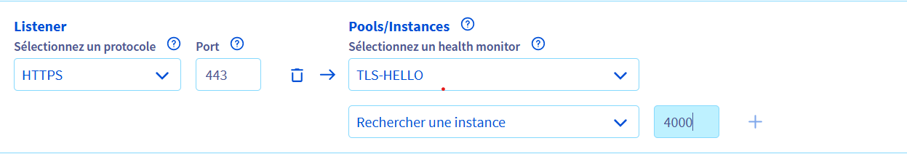

# Déploiement application (https://<your-domaine>, IP privée)

NB: les deux variables globales que vous devez definir sont : <your-domaine> et <your-email>

Dans dns gestion de domaine il faut associé **<your-domaine>** a l'adresse publique de la VM sur la quelle tourne l'application avec type A

## 1. Lancer l’application Next.js (vous pouvez utilser une autre application qui tourne sur 127.0.0.1:3000 ou autre, juste adapte le conf nginx)

```bash
npm run build
npm run start
```

## 2. Installer Nginx

```bash
sudo apt update
sudo apt install nginx
```

## 3.1. Certbot pour générer le certificat manual

```bash
# Cette commande va vous donner une valeur que tu doit le mettre dans ton _acme-challenge.app.productleaderboard.ovh. en type TXT (attends un peut le dns puis continuer pour génerer les certificats)
sudo certbot -d <your-domaine> --manual --preferred-challenges dns certonly

# Pour verifier que la valeur est prix en compte :
dig TXT _acme-challenge.<your-domaine> @1.1.1.1 +short
dig TXT _acme-challenge.<your-domaine> @8.8.8.8 +short

```

## 3.2 Certbot pour générer le certificat auto avec OVH

Voici comment automatiser complètement l’obtention et le renouvellement du certificat SSL pour app.productleaderboard.ovh avec OVH DNS et Certbot :

**Générer les clés OVH**
```bash
1. Connectez-vous sur [OVH Cloud API] : https://api.ovh.com/console/
2. Cliquez sur Create a new application.
3. Donnez un nom, description, et mettez All / GET / POST / PUT / DELETE / Domain/DNS/ selon vos besoins.
4. Notez l’Application Key, Application Secret et générez le Consumer Key.
```

```bash
nano ~/.ovhapi.ini

# OVH API credentials
dns_ovh_endpoint=GRA9     # choisir la region
dns_ovh_application_key=VOTRE_APP_KEY
dns_ovh_application_secret=VOTRE_APP_SECRET
dns_ovh_consumer_key=VOTRE_CONSUMER_KEY

chmod 600 ~/.ovhapi.ini
```

```bash
sudo certbot -d app.productleaderboard.ovh \
  --dns-ovh \
  --dns-ovh-credentials ~/.ovhapi.ini \
  --dns-ovh-propagation-seconds 60 \
  --agree-tos \
  --no-eff-email \
  --non-interactive \
  --email <your-email> \
  certonly
```


## 4. Configurer Nginx pour HTTPS de LB sur l’IP privée 10.1.0.4:4000 en SSL: (HTTPS (LB) <-> HTTPS (Nginx)

Crée le fichier `/etc/nginx/sites-available/nextjs-local-ssl.conf` :
```nginx
# HTTPS LB direct vers Next.js (port LB → 4000)
server {
    listen 4000 ssl; # c'est le port defini dans le pool OVH du LB
    server_name _;  # attrape toutes les requêtes

    ssl_certificate /etc/letsencrypt/live/lb.productleaderboard.ovh/fullchain.pem;
    ssl_certificate_key /etc/letsencrypt/live/lb.productleaderboard.ovh/privkey.pem;

    location / {
        proxy_pass http://127.0.0.1:3000; # url de l'application qui tourne
        proxy_set_header Host $host;
        proxy_set_header X-Real-IP $remote_addr;
        proxy_set_header X-Forwarded-For $proxy_add_x_forwarded_for;
        proxy_set_header X-Forwarded-Proto $scheme;
    }
}

# HTTPS pour accès direct public
server {
    listen 443 ssl;
    server_name <your-domaine>;

    ssl_certificate /etc/letsencrypt/live/<your-domaine>/fullchain.pem;
    ssl_certificate_key /etc/letsencrypt/live/<your-domaine>/privkey.pem;

    location / {
        proxy_pass http://127.0.0.1:3000; # url de l'application qui tourne
        proxy_set_header Host $host;
        proxy_set_header X-Real-IP $remote_addr;
        proxy_set_header X-Forwarded-For $proxy_add_x_forwarded_for;
        proxy_set_header X-Forwarded-Proto $scheme;
    }
}

```

Active la config :
```bash
sudo ln -s /etc/nginx/sites-available/nextjs-local-ssl.conf /etc/nginx/sites-enabled/
sudo nginx -t
sudo systemctl reload nginx
```

## 5. Vérifier le firewall

Pour UFW :
```bash
sudo ufw allow 4000/tcp
sudo ufw allow 443/tcp
sudo ufw allow 80/tcp
sudo ufw status
```

## 6. Vérifier que Nginx écoute sur 10.1.0.4:4000
```bash
ss -tuln | grep 4000
```
## 7. Création du load balanceur OVH

Il faut créer un balanceur puis une instance avec un listener/pool



## 8. Vérifier que l'application marche sur le domaine:
```bash
curl -vk https://<your-domaine>
```
